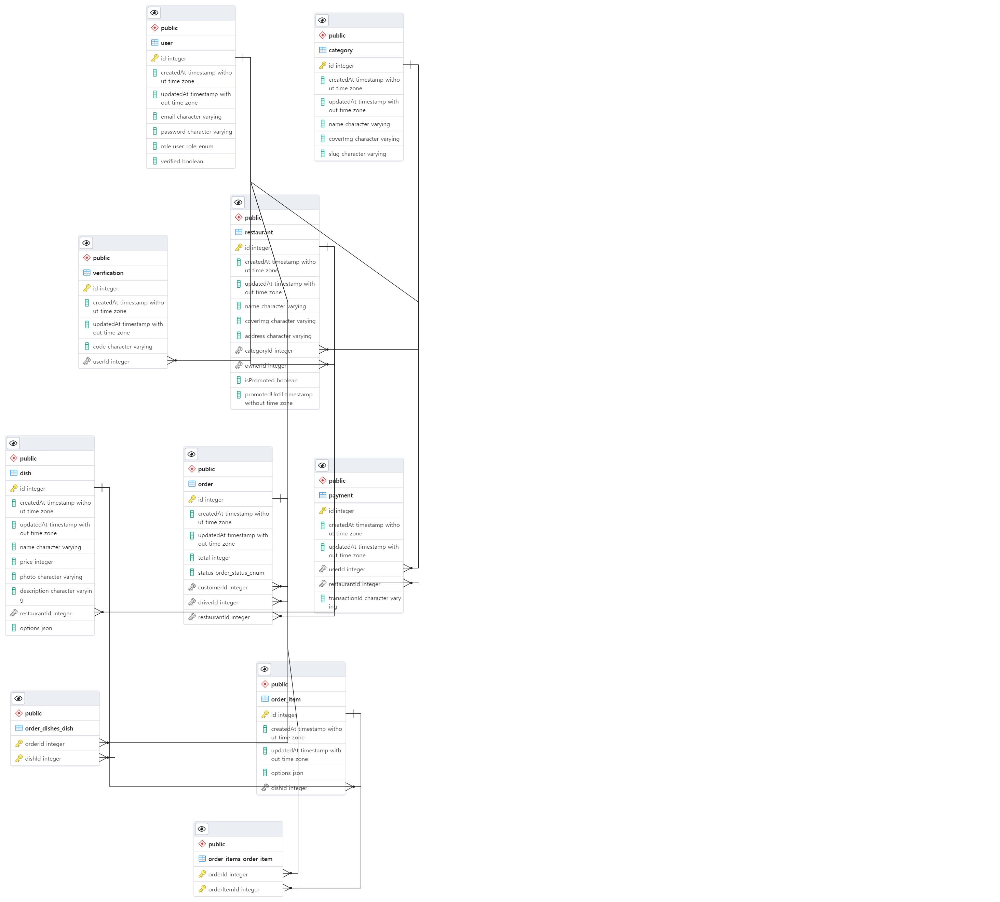

  
# Uber Eats BackEnd
- https://github.com/nohsangwoo/uber-eats-frontend 와 연동됩니다(FrontEnd)
- deploy: https://uber-eats-clone-fe-noh.netlify.app/
    (백엔드배포된 서비스의 상태가 무료버전이라 처음 접속시 sleep된상태에서 깨어나느라 조금 시간이 걸림(1~2분정도 기다려야함))
# 설명에 첨부된 gif파일 크기로 인하여 readme파일을 불러오는데 시간이 좀더 소요될 수 있습니다. 많이 기다려주세요.

  

  

# 구현 내용 및 컨셉

|                        Users                        |                Restaurants                |
| :-------------------------------------------------: | :---------------------------------------: |
|                ✔ User Authentication                |             ✔ Restaurant CRUD             |
|                ✔ Email Verification                 |                ✔ Dish CRUD                |
|                   ✔ Photo Upload                    |     ✔ Realtime Order Notification      |
| ✔ User / Delivery Man/  Restaurant Owner Profile |   ✔ Premium Feature (Online Payment)   |
|                                                     | ✔ Sales Dashboard (Data Visualization) |

| Nest Concepts |            Feature            |
| :-----------: | :---------------------------: |
|   ✔ Modules   | ✔ Online Payments (paddle) |
|   ✔ Guards    |         ✔ Google Maps         |
| ✔ MiddleWares |        ✔ Unit Testing         |
| ✔ Decorators  |     ✔ End to End Testing      |
|               |        ✔ Tailwind CSS         |
|               |     ✔ JWT Authentication      |

  

  

# 사용된 기술

- NestJS
- typescript(for javascript)
- graphql
- postgresql
- nodejs
- aws-sdk
- Jest(for Unit and E2E testing)
- websocket(for realtime subscription)

  

# DATABASE 관계도

# 1 Graphql API

- 렌더링 순서
  main.ts은 appModule(app.Module.ts)을 불러오고 appModule은 각종 모듈로 통하는 도어맨 역할
  (app.Module.ts에서 모든 모듈이나 Graphql resolver 또는 database entity 등을 한곳에 불러모음)
- forRoot()
  모듈을 불러올때 설정값을 조정하는것
- GRAPHQL API는 스키마랑 리졸버가 한개이상 구성돼있어야함 (따라서 처음에 그래프큐엘 세팅시 스키마랑 리졸버가 구성안돼있으니 에러 나올수있음)
