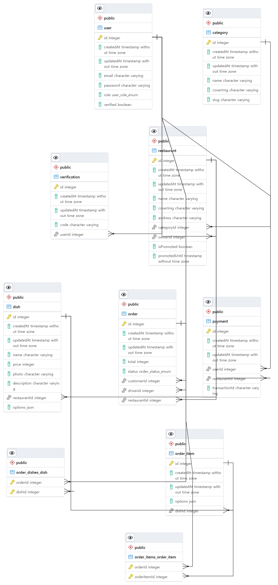

<div>
  
# Uber Eats BackEnd
- Uber eats clone의 백엔드입니다. heroku에 배포했으며 사용된 기술과 개념등을 설명합니다.
- https://github.com/nohsangwoo/uber-eats-frontend 와 연동됩니다(FrontEnd)
- deploy: https://uber-eats-clone-fe-noh.netlify.app/
    (백엔드배포된 서비스의 상태가 무료버전이라 처음 접속시 sleep된상태에서 깨어나느라 조금 시간이 걸림(1~2분정도 기다려야함))

<br><br>

<hr>
<br><br>

# 구현 내용 및 컨셉

|                        Users                        |                Restaurants                |
| :-------------------------------------------------: | :---------------------------------------: |
|                ✔ User Authentication                |             ✔ Restaurant CRUD             |
|                ✔ Email Verification                 |                ✔ Dish CRUD                |
|                   ✔ Photo Upload                    |     ✔ Realtime Order<br>Notification      |
| ✔ User / Delivery Man/ <br>Restaurant Owner Profile |   ✔ Premium Feature<br>(Online Payment)   |
|                                                     | ✔ Sales Dashboard<br>(Data Visualization) |

| Nest Concepts |            Feature             |
| :-----------: | :----------------------------: |
|   ✔ Modules   | ✔ Online Payments<br>(paypal)) |
|   ✔ Guards    |         ✔ Google Maps          |
| ✔ MiddleWares |         ✔ Unit Testing         |
| ✔ Decorators  |      ✔ End to End Testing      |
|               |         ✔ Tailwind CSS         |
|               |      ✔ JWT Authentication      |

<br><br>

<hr>
<br><br>

# 사용된 기술

- NestJS
- typescript(for javascript)
- graphql
- postgresql
- nodejs
- aws-sdk
- Jest(for Unit and E2E testing)
- websocket(for realtime subscription)

<br><br>

# Entity Relationship Diagram



# 1 Graphql API setting up

- 렌더링 순서
  main.ts은 appModule(app.Module.ts)을 불러오고 appModule은 각종 모듈로 통하는 도어맨 역할
  (app.Module.ts에서 모든 모듈이나 Graphql resolver 또는 database entity 등을 한곳에 불러모음)
- forRoot()
  모듈을 불러올때 설정값을 조정하는것
- GRAPHQL API는 스키마랑 리졸버가 한개이상 구성돼있어야함 (따라서 처음에 그래프큐엘 세팅시 스키마랑 리졸버가 구성안돼있으니 에러 나올수있음)

# entity

Entity 클래스는 실제 DataBase의 테이블과 1 : 1로 매핑 되는 클래스로, DB의 테이블내에 존재하는 컬럼만을 속성(필드)으로 가져야 한다.
Entity 클래스는 상속을 받거나 구현체여서는 안되며, 테이블내에 존재하지 않는 컬럼을 가져서도 안된다.

- \*.entity.ts
- 해당 파일로 DB table이 구현됨
- 해당 파일은 각 모듈에서 TypeOrmModule로 import해서 사용한다.

# Type

- @InputType() // from '@nestjs/graphql';
  전달하는 arguments 존재
- @ObjectType() // from '@nestjs/graphql';
  object type
  이후 선언되는 type을 지정
- @Field(type => String) // for graphql

- @Column() // for typeorm

# about

- validation
  @IsString(), @Length(5) // type은 string, text의 길이는 5자 이상 등등 validation을 위한 다양한 데코레이터 존재

- @Field(type => Boolean, { nullable: true })
  해석 : 기본적으론 Boolean type이지만 null형식이 허용된다. (필수로 값이 채워지지 않아도 된다 Not Required, 대신 값이 지정되지 않으면 null값으로 채워짐)

# class-validation

- class-validation을 사용하기 위해선 main.ts에서 useGlobalPipe설정 해줘야한다

# TypeORM AND NEST

- entity생성 후 사용시, app.module.ts => typeorm.forRoot(typeorm옵션 설정)의 항목중 entities항목에 사용하고자 하는 entity를 추가
  (src/app.module.ts)참고

# Data Mapper vs Active Record

typeorm 사용시 Data Mapper와 Active Record 둘중 하나의 패턴을 사용할 수 있음(typeorm을 사용하는 방식)

- data mapper pattern 채택이유
  data mapper pattern이 유지관리와 대규모 프로젝트에 보다 적합하고 또한 nestjs사용시 좀더 친화적으로 사용가능(Repository 기능)

# listener

entity에 변화가 있을때 custom으로 무엇인가 작업을 할때 사용되는 기술
간단한 예)

- @BeforeInsert()
  해당 entity에서 insert되기 직전에 실행되는 내용
- @BeforeUpdate()
  해당 entity에서 update되기 직전에 실행되는내용

  ```
    @BeforeInsert()
    @BeforeUpdate()
    async hashPassword(): Promise<void> {
        if (this.password) {
        try {
            this.password = await bcrypt.hash(this.password, 10);
        } catch (e) {
            console.log(e);
            throw new InternalServerErrorException();
        }
        }
    }

  ```

  등등 이러한 형태로 사용가능.

# DTO(Data Transfer Object)

- Entity와 DTO를 분리해서 관리해야 하는 이유는 DB Layer와 View Layer 사이의 역할을 분리 하기 위함
  Entity 클래스는 실제 테이블과 매핑되어 만일 변경되게 되면 여러 다른 클래스에 영향을 끼치고, DTO 클래스는 View와 통신하며 자주 변경되므로 분리 해주어야함

- view layer와 DB layer 사이의 data type과 종류, 해당 쿼리가 실행되고 return되는 type과 종류를 validation 해줄수있음
  DTO파일은 entity를 extends해와서 partialtype(옵셔널- entity에서 불러온 목록을 사용해도되고 안해도되고로 설정) , picktype(entity에서 불러온 목록을 required(필수)를 기본으로 해서 설정)

- 간단한 데코레이터 설명
  @InputType과 DTO를 묶어 DB로 전달 하는 args의 validation을 진행
  @ObjectType과 DTO를 묶어 결과값을 반환하는 data의 validation을 진행
  사용예)

  ```
  @InputType()
  export class LoginInput extends PickType(User, ['email', 'password']) {}
  @ObjectType()

  export class LoginOutput extends CoreOutput {
  @Field(type => String, { nullable: true })
  token?: string;
  }
  ```

- entity에서 @ObjectType 과 @InputType데코레이션을 같이 사용 하는경우
  DTO사용시 어차피 picktype이나 omittype등으로 entity에서 요소를 골라 사용하기때문에
  같은내용울 두번 지정할 필요없이 한번에 entity인 동시에 inputype과 objecttype으로 사용가능하다고 설정
  사용예)

  ```
  @InputType('OrderItemInputType', { isAbstract: true })
  @ObjectType()
  @Entity()
  export class OrderItem extends CoreEntity {
  @Field(type => Dish)
  @ManyToOne(type => Dish, { nullable: true, onDelete: 'CASCADE' })
  dish: Dish;

  @Field(type => [OrderItemOption], { nullable: true })
  @Column({ type: 'json', nullable: true })
  options?: OrderItemOption[];
  ```

- isAbstract
  해당 DTO를 그대로 가져다 쓰는게아니라 추상적으로 어딘가에 복사하여 사용한다는 의미
  어쨌든 objecttype과 동시에 설정 하려면 해당 옵션을 true로 설정

# User authentication

- jsonwebtoken을 이용하여 토큰 생성 및 user verify진행
  (src/mail/mail.service.ts)참고

# user verify(with mailgun api)

- sandbox버젼이라 인증 이메일 보낼때마다 mailgun에 수동으로 등록해야함
  또는 카드 등록후 무제한으로 사용하면됨(하지만 현재 불가)
- email 서비스는 mailgun을 사용
  https://www.mailgun.com/ 참고
- 회원가입후 인증번호 확인 시스템을 구현
- got라이브러리로 post요청
  (src/mail/mail.service.ts)참고

# dependency injection

- service를 export하여 어디서 사용할것인가를 설정

- 위 export한 service를 app.module에서 불러와 전역에서 사용가능하게 만들수도있다

- 또한 특정 module에서 끌어와 해당 모듈에서만 사용가능하게 consumer를 건들여 설정하는 방법이 있음

# @Global() 데코레이터

해당 모듈은 다른모듈 어디서든 제약없이 불러다 사용할 수 있다는 의미

# 인증 과정

1. login하면 token생성 jsonwebtoken을 이용하여 암호화 함.
2. http header로 해당 token정보를 보냄 (headers['x-jwt'])란 곳으로 저장됨
   //middleware--start
3. 생성된 token의 정보로 무엇인가 요청할때마다 권한종류를 알아내기위해verify작업 함.(암호화된 token을 해독하는 작업)
4. 위에서 decoded된 token의 정보(login한 user)를 request object에 붙여서 보냄
   //middleware---end
5. 이제 middleware단에서 변경된 request object를 모든 resolver에서 사용가능

# token 받아오기, (JWT Middleware 미들웨어 설치 방법)

- http headers 를 활용하는 방식으로 받아온다

- request.headers['x-jwt']에 저장된 토큰값을 뽑아와서 서버단에 토큰값이랑 일치하는지 확인하는 작업진행

- middleware설치 방법
  main.ts => bootstrap에 설치하여 전구간에 사용가능하도록 설정
  (이때 미들웨어는 function 형식이어야 함)
  app.module.ts에서 consumer를 이용하여 일련의 상용구로 설치가능
  (이때 미들웨어는 class형식이어야 함)

# export module

- jwtmiddleware.ts에서 UserService를 사용하고싶을때
  users.module.ts에서 exports:[UserService] 설정을 해주면 됨

# request context (appmodule)

req단에 저장된 데이터를 graphql단에 끌어와 사용하는 방법

request context는 각 request에서 사용이 가능하다.
context가 함수로 정의되면 매 request마다 호출된다.
이것은 req property를 포함한 object를 express로 부터 받는다

즉 context에 저장된 데이터는 graphql의 어떤 쿼리문이나 mutation문에서든 불러올수있다.

- context적용방법
  in (app.module.ts에서 imports)
  ```
  GraphQLModule.forRoot({
    autoSchemaFile: true,
    context: ({ req }) => ({ user: req['user'] }),
  }),
  ```
  해석:
  jwtmiddleware로부터 저장된 req['user']의 값을 불러와
  user라는 키값에 할당된 오브젝트를 모든 구역의 graphql에서 불러올수있음

1. apollo server나 graphql의 모든 resolver에서 사용가능하도록 설정해줌(ex..req)
2. JWTmiddleware를 거쳐서 graqhql context에 request user를 전달해줌
   token을 전달한 http와 같음

- in (user.resolver.ts에서)

```
  me(@context() context){
    console.log(context.user);
  }
```

# AuthGuard

- Guard Concept

1. implements CanActivate해서 사용
   (보일러플레이트 src/auth/auth.guard참고)
   CanActivate => true를 return 하면 request를 진행시키고 false를 return 하면 request를 멈춤
2. function의 기능을 보충해줌 조건에 따라 true false로 함수의 기능을 사용할지 차단할지 설정해줌
   (이안에서 사용될 함수의 이름은 canActivate)
3. 위에서 http형식의 context를 graphql형식으로 변환해서 가져옴
4. 전달받은 내용을 가지고 조건을 걸어서 true or false를 return함

   - ExecutionContext는 (app.module.ts => graphqlmodule.forRoot => 전역 사용하게 가능한 context)에서 전역설정된 http의 context를 가져다 사용하겠다는말
   - 그 가져온 데이터값을 context라는 변수에 넣어줌끌어와 사용하는 작업)
   - 위에서 가져온 http의 context를 graphql에서 사용할수있게 변환후 gqlContext라는 변수에 넣어줌
     (src/auth/auth-user.decorator.ts)참고

5. 인증과정을 통하여 request를 진행시킬지 말지 결정가능

- authentication
  누가 자원을 요청하는지 확인하는 과정(token으로 identity를 확인하는 작업)

- authorization
  user가 어떤일을 하기전에 permission을 가지고있는지 확인하는 작업(ex. userRole)

# AuthUser Decorator

- login 되어있지 않다면 request를 멈추게 할꺼고 login됐다면 request를 진행시키는 custom 데코레이터 생성
- createParamDecorator
  데코레이터를 만드는 함수
  (이것을 이용하여 custom데코레이터 생성)

1. 데코레이터 적용은 custom된 데코레이터 파일을 불러와서 resolver에 설치 가능
   (여기선@AuthUser라는 이름의 데코레이터를 users.resolver.ts에 설치)
2. 위 데코레이터의 인증과정이 끝나면 users.resolver.ts에서 graphql형식으로 변환된 user데이터를 끌어와 사용할수있음
   (resolver는 graphql을 위한 작업파일이니깐)

# recap

- (##authentication 작동 정리)

- token을 graphql의 HTTP HEADERS에서
  "x-jwt"라는 이름으로 담아 server로 전달하고있음
  headers는 http 기술중 하나다
  그래서 http기술을 사용하기위해 jwt.middleware.ts를 만들었음

- part1 => jwt.middleware.ts의 기능

  1. NestMiddleware를 implements하여 middleware로 만들어준다(use기능을 꼭 포함하여야함)
  2. req.headers['x-jwt']로 token을 가져와 token이란 변수에 담아준다
  3. 가져온 token을 디코딩한다 - jwt.verify함수를 이용하여 서버단의 privateKey를 가지고 디코딩하고 decoded라는 변수에 저장하는 작업 (그과정에 privateKey를 사용하여 token의 값이 변경됐는지 확인해줌)
  4. 그다음 디코딩된 decoded에서 id를 추출하여 users DB에서 해당 id와 동일한 user data를 찾아와 request object에 붙여 반환한다.
     (이때 찾지못하면 fail error를 던짐)
     이 middleware를 가장 먼저 만나기 때문에 middleware가 원하는대로 request object를 바꿀 수 있다.
     그러면 middleware에 의해 바귄request object를 모든 resolver에서 사용가능
     token이 없거나 에러가 나거나 디코딩된 totken으로(id값이 jwt로 token화 됨) user를 찾을수 없다면 request object에 데이터가 추가되지 않는다

- part2 => context
  (app.module에서 graphlQLModule.forRoot의 context)

  1. apollo server의 context나 graphql의 context는 모든 resolver에 정보를 보낼수 있는 property이다
  2. context get이 매 request마다 호출될것이다
  3. context에서 function을 만들면 해당 function이 request object를 줄것이다. 여기서 request object는 전에 만들어둔 user key(token)를 가진 http이다

  4. jwtmiddleware를 거치고 graphql context에 request user를 보내는 순서로 진행됨

- part3 => authGuard

  1. canActivate는 function의 기능을 보충해주는데 이 function은 true나 false를 return 한다
  2. 이때 true를 return하면 request를 진행시키고 false를 return하면 request를 중단한다.
  3. 그리고 여기서 불러오는 context:ExecutionContext는 nestjs Context이다
  4. graphql 형식으로 변환해주는 작업을 거쳐( GqlExecutionContext.create(context).getContext()) 변수에 저장한다
  5. (gqlContext) 여기서 불러오는 getContext는 app.module.ts의 graphql.forRoot에서 설정된 context의 값이다
  6. 그리고 반환된 context object에서 user라는 key를 뽑아와 user라는 변수에 저장한다.
     (app.module.ts의 graphql.forRoot에서 설정된 context의 값을 보면 user라는 key에 저장했으니 뽑아올때도 gqlContext['user] 식으로 가져옴 )
  7. 여기서 user가 존재하면 true를 반환 존재하지 않으면 false를 반환하여 canActivate를 활성화
  8. jwtmiddleware를 거치고 apollo server의 context를 거치고
  9. graphql context에 user key를 가진 object를 보내고
  10. authorization guard를 거쳐서 마지막으로 reeesolver에 도착하면 데코레이터가 있음

# me() Qurery => auth-user.decorator.ts (@AuthUser)

1. graphql context를 가져오는 작업을 거쳐 gqlContext['user']를 가져온다
2. 이 데코레이터가 user의 값을 가져오는것을 성공하면 반환값을 가지는데

```
   me(@AuthUser() authUser: User) {
      return authUser;
   }
```

이런형식으로 사용한다

3. 이때 @AuthUser() 의 반환된 user값은 authUser변수에 저장되고 그 type은 User이다
   (src/users/entities/user.entity.ts에서 설정된 validation)

4. jwtmiddleware를 거치고 apollo server의 context를 거치고 graphql context에 user key를 가진 object를 보내고 authorization guard에 의해 request가 authrize되면 마지막으로 resolver의 @AuthUser데코레이터에 도착하는데, 이 데코레이터는 context에서 user를 찾아와 그 값을 authUser에 저장하여 me qeury의 반환값으로 설정해줌

# editProfile

user.resolver.ts 에 추가 user의 정보를 불러오는 작업

1. editProfile 의input과 output의 DTO를 만들어줌
2. 개인정보수정 기능(email, password)
3. edit profile 의input과 output의 DTO를 만들어줌
4. 위 기준으로 user.service.ts에서 실질적인 editprofile 기능을 구현 이때 save로 구현
5. middleware단에서(user.entity.ts) @beforUpdate() 데코레이터로 save되기직전 해시화 할수있게 설정
6. 원래는 update()로 수정을 구현하려고했는데 이렇게하면 beforeupdate 데코레이터를 사용할수없음
   왜냐하면 update()는 빠른대신 아무것도 확인안하고 그냥 무조건 쿼리를 날려버림 그래서 beforeUpdate도 작동안함
   따라서 save를 사용하고 beforeupdate를 미들웨어단에서 불러와 password수정시 해시화 할수있게 설정해줌
7. 때에 따라서 update()를 save()대신 사용하던가 할수있음
   (간단하고 빠르기때문에)

# EMAIL VERIFICATION (이메일 검증)

- 유저가 계정을 생성하면 일련의 인증과정을 거쳐서 생성되게함 그 과정을 담당하는 table이 verification이고 이것은 email인증으로 이루어질것임

- 이메일인증은 서버단에서 이메일로 일련의 암호화된 코드? 를 보내면 유저는 해당 이메일에서 그것을 인증하여 최종적으로 계정이 만들어지는 과정을 거침

# verification 테이블 생성

src/users/entities에 verification.entity.ts추가
(테이블을 하나 만드는것)

- OneToOne (1:1관계)
  verification은 users와 1:1관계이다 그리고 둘중 한곳에 @JoinColumn()가 정의돼야함 이경우엔 verification쪽에 정의함
  (verification에서 user로 접근하는경우엔 verification쪽에 @JoinColumn()가 정의되고
  user에서 verification로 접근하는경우엔 user쪽에 @JoinColumn()가 정의됨)
  @JoinColumn()을 포함하고있는쪽에 relation id를 외래키로 가지고있음

# select:false

- 다른곳에서 relations:['user']로 선택해서 user를 불러올때 password는 선택되지 않게 하는 작업

```
  @Column({ select: false })
  @Field(type => String)
  @IsString()
  password: string;
```

- verification을 통하여 user를 불러오고 싶으면 확실하게 설정해줘야 불러올수있음

```
  const verification = await this.verifications.findOne(
    { code },
    { relations: ['user'] }
  );
```

(즉 이런식으로 relations를 user로 지정해줘야 verification.user를 사용가능)
(또는 user entity에서 eager설정, eager는 나중에 설명함 )

- verification은 user와 거의 비슷해서 따로 모듈을 만들지 않고 그냥 user모듈의 일부분으로 합침
- verification code를 사용해서 그들의verification을 찾음, 그걸 지우고 그다음 user를 verifiaction함

- recap
  users.service.ts의 uverifyEmail에서 relations:['user']로 user을 불러오고 select할때
  user.entity.ts의 password설정이 select:false라서 password를 제외하고 불러옴
  따라서 이때 user.entity의 @BeforeUpdate에서 hashPassword가 작동되지 않음
  (조건문으로 password가 있을때만 실행되게 설정함)

- onDelete: CASCASDE 여기서는 user 테이블쪽에서 필드가 삭제되면
- 그에 의존하고있는(1:1관계인 verification)필드도 같이 삭제된다는 뜻

# mailgun

- mail.service.ts 작성
  nodeJs에서 request를 쉽게 작성하게 해주는 GOT패키지를 설치
  거기에 form-data패키지를 사용하여 form 처리 완료

- mailgun template service
  메일받았을때 form을 html과 css로 꾸밀수있음

# unit Testing the user test

Jest를 이용한 uit test방법

# unit test for user part

user.service.spec.ts생성(테스트파일)

```
npm run test:watch
```

- beforeAll 테스트 모듈을 만들어줌
  \*\*즉 graphql등 과 상관없이 오직 UserService파일만을 위한 독립된 별개의 테스팅환경을 만들어주는것

# Jest 경로 에러 수정 및 Mocking

- Jest 경로 에러 수정은 package.json에서 수정해줌

```
  "jest": {
  "moduleNameMapper": {
      <!-- src로 시작하는 경로포함방식을 찾는다면
      해당 모든 황작자와 모든 경로는 Root Directory에서 찾아내라고 알려주는 설정 -->
    "^src/(.\*)$": "<rootDir>/$1"
    },
    "rootDir": "src"

    <!-- 여기가 root Directory -->
    ...
  }
```

- mocking (가짜 함수 또는 가짜 변수로 대체 해줌)
  repository를 포함하고 있는 모듈에서 repository를 가짜로 속이려고 만드는 설정
  Mock repository를 생성 => 이런 일련의 작업을 mockicng 이라고함
  첫번째로 테스팅 모듈 생성시 providers에서 최상위 대체 대상을 모킹하고
  그 대체대상이 포함하고있는 함수를 사용할경우
  사용예)

  ```
  //---------------
  const mockRepository = () => ({
    findOne: jest.fn(),
    save: jest.fn(),
    create: jest.fn(),
    findOneOrFail: jest.fn(),
    delete: jest.fn(),
  });
  //---------------
  const mockJwtService = () => ({
    sign: jest.fn(() => 'signed-token-baby'),
    verify: jest.fn(),
  });
  //---------------
    const mockMailService = () => ({
    sendVerificationEmail: jest.fn(),
  });
  ```

  (설정된 함수는 테스팅 모듈을 포함할때 useVale에 포함한다)

  이런식으로 설정하여 사용한다

# 테스팅 제외 (package.json)

```
  "coveragePathIgnorePatterns": [
  "node_modules",
  ".entity.ts",
  ".constants.ts"
  ]
```

test:cov에서 현재 얼마나 테스트가 완료됐는지 계산해서 퍼센테이지를 보여주는데
entify파일과 constants 파일은 테스트 할필요가 없으니 제외하기위해서 poackage.js에 추가

- toHaveBeenCalled()
  몇번 호출됐는지 상관없이 호출됐는지만 확인(안쓰여서 부가 설명)

# 테스팅 진행 현황

```
npm run test:cov
```

# beforeAll 과 beforeEach차이

- beforeAll 각 테스팅시 호출스택을 공유하고 beforeEach은 각 테스팅마다 호출을 별개의것으로 구분

# mockResolvedValue와 mockReturnValue의 차이

반환값이 있을때 promise를 return 하는가 아닌가의 차이
반환값이 promise를 return하면 mockResolvedValue
(ex. save,findeOne..등 보통 여기선 DB를 제어하는 함수인경우)
반환값이 promise를 return하 않으면면 mockReturnValue
(ex. create..등 보통 여기선 일반 javascript 함수인경우 물론 예외도 있음)
가장 중요한건 mockResolvedValue와 mockReturnValue는 반환값을 mocking하는것

# 특정파일만 테스트 하고싶을때

@blackstar0223 Check "collectCoverageFrom" in package.json.
In my case:

```
"collectCoverageFrom": [
  "**/*.(t|j)s"
],
```

I modified it:

```
"collectCoverageFrom": [
  "**/*.service.(t|j)s"
],
And then jest --coverage shows only \*.service.ts(or js if exists) files.
and I didn't set coveragePathIgnorePatterns
```

# slug

- 검색시 사용할 목적으로 작업
  특정 규칙을 이용하여 검색단어를 최적화 하는 작업()
  예시)

  ```
  //...createCategoryInput.name is Search term...

  const categoryName = createCategoryInput?.name.trim().toLowerCase();
  const categorySlug = categoryName.replace(/ /g, '-');
  ```

# 메타데이터 사용(SetMetadata 사용법)

- SetMetadata를 이용한 role Decorator생성 방법 숙지
  restaurant의 resolver에는 user를 위한 기능, delivery를 위한기능, owner(사장)을 위한 기능이 각각있는데
  이 구분을 SetMetadata로 지정해서 구분

# 전구역의 resolver에서 AuthGuard를 사용하고싶다면 APP_GUARD를 이용

- 메타데이터가 설정됐으면 해당 resolver는 public이면 안됨
  (즉 메타데이터가 설정됐다면 user의 role을 확인해야 한다는 뜻)
- 메타데이터가 설정안됐다면 user auithentication을 신경쓰지 않는다는 의미
  예컨데 user의 createAccount나 login에는 메타데이터가 필요하지 않음
  (누구나 만들거나 로그인 시도 할수있어야하니깐)

- 설정한 metadata를 불러와서 사용하는 방법
  여기선 auth.guard.ts에서 설정된role메타데이터를 불러와서 사용함

- authGuard는 CanActivate를 상속받음
  따라서 AuthGuard 는 true 또는 false만 return 함
  true를 반환하면 request진행이 허용됨
  false를 반환하면 request진행이 불가함을 결정

- 메타데이터를 설정했다는건 로그인된 상태이길 기대하는 것임
  //정리 : 메타데이터로 owner만 접근 가능하게 resolver에서 setmetadator로 설정된 resolver가 있는데
  //만약 로그인한 유저가 client이거나 deliver라면 해당 resolver의 기능은 사용할수없고
  // 오직 owner의 권한을 가진 user가 로그인해야만 해당 기능을 사용 가능함

# 10.6 recap role part

# 10.7~8 editRestaurant

- @RelationId()
  정의된 relation 대상의 id를 가져옴
- 132

# 10.9 custom repository 방법 3가지

이번엔 catogory repository를 custom하는데
해당 category repository를 로드할 때마다 getOrCreate를 실행해줌

# 10.10

// update를 한다면 id를 같이 보내줘야함
// 만약 id를 보내지 않는다면 새로운 객체를 insert하겠다는 의미가 됨

# 10.11 delete restaurant

1. resolve 만들고 필요한 인자값은 restaurantId, 반환되는 결과값은 ok error
2. DTO만들기
3. service에 실제 사용되는 함수 구현

# 10.12 category part one

- 모든 카테고리를 찾아주는 함수 => input이 필요하지않음
  category part를 새로운 모듈로 만들지 않는 이유는 단지 규모가 너무 작아서 그렇기 때문 모듈을 따로 나눠도 상관없음

- @ResolveField
  매번 request마다 계산된 행동을 해줌
  (db와 별개의 움직임 graphql에서 자체적으로 동작하는 함수)

# 10.13 category part two => restaurant count

- restaurantCount라는 dynamic field를 만들었음
  해당 카테고리에 속하는 restaurant의 개수를 계산해줌
- @Parent()
  restaurantCount는 entity마냥 field형식으로 graphql의 return 값중 하나로 사용되고 Parent는 category라고 연결해줌
- ex

```
{
  allCategories {
    ok
    error
    categories {
      id
      slug
      name
      restaurantCount
    }
  }
}
```

이런식으로 사용된다고했을때

```
{
  "data": {
    "allCategories": {
      "ok": true,
      "error": null,
      "categories": [
        {
          "id": 1,
          "slug": "korean-bbq",
          "name": "korean bbq",
          "restaurantCount": 0
        },
        {
          "id": 2,
          "slug": "the-bestest-grater-food-restraurant",
          "name": "the bestest grater food restraurant",
          "restaurantCount": 1
        }
      ]
    }
  }
}
```

이런결과값을 가짐
(즉 각각의 category결과값에대한 restaurant가 count된 값을 계산해서 반환함)

# pagination feat category

- category에 해당하는 레스토랑을 검색시 pagination기능을 추가
- pagination을 수동으로 구현

1. pagination에 필요한 dto 구성
2. restaurant정보를 무조건 다 불러오는게 아니라 25개씩 나눠서 불러옴
   (전엔 모든 카테고리에서 restaurant를 불러왔는데 그게아니라 따로 나눠서 25개씩 조건에 따라 나눠서 불러옴)
3. 불러온 25개의 restaurant 데이터를 category에 추가해줌
   (obect형식)
4. category 총 개수, category를 25개씩 나눈 총 페이지 수
   코드 예시

```
const [restaurants, totalResults] = await this.restaurants.findAndCount({
    where: {
      name: Raw(name => `${name} ILIKE '%${query}%'`),
    },
    skip: (page - 1) * 25,
    take: 25,
  });
  return {
    ok: true,
    restaurants,
    totalResults,
    totalPages: Math.ceil(totalResults / 25),
};
```

# Restaurant and search

아이디로 레스트랑을 검색하던가 레스토랑 이름으로 레스토랑을 검색하는 두가지 방법을 구현
findRestaurantById
searchRestaurantByName

- Like사용법 sql 명령어중 하나임
  like는 비슷한 값을 찾아주는것
  여기선 query라는 단어가 앞뒤 중간 어디라도 포함된다면 검색해달라는 뜻
  만약 Like(`${query}%`) 이런식이라면 query라는 단어로 시작되는 데이터를 검색해달라는 뜻
  name: Like(`%${query}%`),

# ILike sql문 사용법

Like는 대문자 소문자를 구분검색 ILike는 대소문자 구분없이 검색

- Raw는 nest에서 제공하는 typeorm이 아닌 수동으로 sql문을 사용하고 싶을때

For those who use MySQL, LIKE is already case-insensitive. If you want to search case-sensitively, you have to use BINARY.
이미 sql의 like는 대소문자를 구분하지 않음
오히려 대소문자를 구분하고 싶다면 BINARY를 사용해야함
아래 예시 참조
ex) Raw(name => `${name} LIKE BINARY '%${query}%'`)

# dish entity

1.  dish.entity.ts만든다
2.  app.module에 엔티티 추가
3.  restaurant와 @OneToMany관계 설정
    restaurant와의 관계는 레스토랑이 one dish가 many
    (즉 하나의 restaurant은 여러개의 dish를 가지고있을수있다)
4.  이때 dish는 restaurant에 {onDelete:CASCADE}속성을 가짐
    (restaurant가 삭제된다면 restaurant에 연결된 모든 dish가 같이 삭제됨)
5.  dish.entity.ts에서 @RelationId()데코레이션을 이용하여 restaurantId 을 가져옴
    (RelationId는 foreign key이다)

# dish option

예를들면 피자를 주문할때 선택하는 맛(옵션)
ex..피글빼주세요, 치즈 더 추가해주세요..등등

- create-dish

1. create dish시 DishOption과 관련된 항목을 dish.entity에 추가
   DishOption은 type:json 형식이다
   (구조화된 데이터를 저장하거나 특정 형태를 가진 데이터를 저장해야할때 json type을 사용)
   완전 정석으로 하려면 json type이 아니라 새로운 DishOption entity를 만들고 relation 정의를 해주고...등등 해줘야함
2. create-dish.dto.ts 만들어준다
3. dish resolver를 restaurant.resolver.ts파일에 추가해줌
4. createDish기능을 dish resolver에 추가
5. createDish의 실제로 작동되는 기능은 restaurants.service.ts 에 추가
6. 이때 레스토랑 검색시 relation관계에 있는 menu도 같이 검색가능하게 만들기위해 아래와 같이 변경

```
findRestaurantById의 레스토랑 검색하는 부분을
const restaurant = await this.restaurants.findOne(restaurantId, {
    relations: ['menu'],  //<== 추가된 부분
});
```

# flat() 중첩 배열 평탄화 및 배열의 빈값 제거

- 중첩배열 평탄화 예시

```
const arr1 = [1, 2, [3, 4]];
arr1.flat();
// [1, 2, 3, 4]

const arr2 = [1, 2, [3, 4, [5, 6]]];
arr2.flat();
// [1, 2, 3, 4, [5, 6]]

const arr3 = [1, 2, [3, 4, [5, 6]]];
arr3.flat(2);
// [1, 2, 3, 4, 5, 6]

const arr4 = [1, 2, [3, 4, [5, 6, [7, 8, [9, 10]]]]];
arr4.flat(Infinity);
// [1, 2, 3, 4, 5, 6, 7, 8, 9, 10]
```

# getOrder 주문 하나를 가져옴

# edit Order 주문수정(주문 진행 단계 변경)

# Subscriptions part One

- graphql-subscriptions 설치
  npm install graphql-subscriptions

- const pubsub = new PubSub() 을 이용하여 구현

- app.module.ts의 Graphql설정에서 installSubscriptionHandlers: true을 옵션으로 주고 subscription웹소켓을 활성화 시킴
  (다만 이럴때 원래 서버는 http request를 먼저 받아와야하는데 웹소켓을 먼저 받아오는 방식으로 활성화돼서 작동이안됨 )
  따라서 웹소캣에서 http를 받아오려면 또다른 설정이 필요함 #12.1 에서 계속

# 12.1 Subscriptions part Two

- realtime 으로 변경된 데이터를 프론트엔드에서 감지가능한 기능

# 12.4 pubsub

- subscriptoion을 위한 라이브러리
- pubsub 사용방법 및 pobsub의 기능 좀더 살표보기

# 12.5 Subscription Filter

- filter설정을 안해주면 내가 원하지 않는 부분도 Subscription해버린다.
  ex order id가 1인 내용만 Subscription하고싶은데 order id가 6이건 33이건 다른 조건도 Subscription해버린다던지...

  // 특정조건만 Subscription 할수있게 필터링해주는것
  // filter에는 3개의 인자를받는다(filter(payload,variables,context))
  // 1. payload는 potatoReady 등 같은 함수에서 전달받은 값
  // 2. variable은 listening을 시작하기 전에 subscription에 준variables를 가진 object

  ```
    ex 그래프큐엘에서 구독하는 방법
    subscription{
      readypotato(potatoId:1)   <= 여기서 1이 variable
    }
  ```

# 12.6 Subscription Resolve 설명

subscript에서 전달받은 payload를 기준으로 custom function을 만들어 반환해줌
(일반적인 resolver개념이랑 비슷한듯)

- 정리
  update를 받을지 말지는 Subscription Filter가 결정하고
  Subscription Resolve는 output의 모습을 바꿔줌

# 12.7 pendingOrders Subscription part One

- order를 업데이트한뒤 그 업데이트한 값을 반환받아서 Subscription에 pubsub을 이용하여 subscription 웹소켓서버로 업테이트값을 전달한다
  본격적으로 subscription trigger를 이용하여 order정보를 전달하고 전달받는 작업

# 12.8 pendingOrders Subscription part Two

- owner가 음식 준비를 완료하고 픽업할 준비가 되면 trigger되는 subscription이다

# 12.9 cookedOrders delivery 만 볼수있는 구독 기능

- create가 있는 상태의 반환값이랑 없는 상태의 반환값이다름
  (create가 있는경우는 order의 반환값이 모든 relation을 포함하여 잘 return됨)

- delivery는 모든 order를 전부 실시간으로 subscription해야하니 filter function을 사용하지 않음

````
      const order = await this.orders.save(
        this.orders.create({
          customer,
          restaurant,
          total: orderFinalPrice,
          // relationship을 저장하는것
          // manyToMany임
          items: orderItems,
        })
      );
      ```
````

(create가 없는경우 업데이트된 상태를 반환못하고 또한 필드에 포함된 컬럼중 일부 컬럼만 반환됨)

```
    const newOrder = await this.orders.save({
        id: orderId,
        status,
      });
```

# eager

- relataion관계에 있는 entity간 필드를 load할때마다 자동으로 load되는 relation을 정함
  코드예)

```
 const order = await this.orders.findOne(orderId, {
        relations: ['restaurant'],
  });
```

이런식으로 relations: ['restaurant'], 옵션 안줘도 relation관계 데이터가 default로 불러와질수있게 설정하는것

- 별개로 lazy relation이라는게 있는데 이건 order에 있는 restaurant정보를 가져오고싶다면
  await order.restaurant.fineOnd(.....)
  이런형식으로 사용

- editOrder가 성공적으로 update됐다면 subscription trigger를 작동하여 구독기능 작동

# orderUpdates

- order정보가 수정되면 order와 '관련된' 모든 로그인된 사용자는 수정정보를 실시간으로 확인할 수 있다.

# take order

- 배달원이 주문을 접수하는 기능
- 배달언이 주문 접수를 안했을때 order의 driver부분은 null상태
- 배달원이 주문접수를 하면 order에 주문접수한 driver정보(이 주문을 배달하기 위한 배달원의 정보)를 업데이트 하는것

- 주문에 배달원 할당되면 미리 만들어둔 orderUpdates 구독기능을 동작시켜서 해당 주문과 관련된 로그인한 모든 user에게 실시간으로 변동사항을 알림

# PAYMENT 결제방식

- stripe, braintree, 카카오페이, 나이스페이, paddle, paypal 등이있음
- create Payment Module And setting
  paypal결제 방식 선택(결제내역은 백엔드에 저장하고 결제진행은 프론트엔드에서 진행)

# getPayments

- 레스토랑 주인이 결제정보 읽어오는 기능

# 자동화 기술 @nestjs/schedule

```
 npm install --save @nestjs/schedule
```

- 원하는 time interval 또는 정해진 시간과 날짜에 function을 실행할 수 있게 만듬

- cron pattern
  https://docs.nestjs.com/techniques/task-scheduling
  여기서 예시 확인
  (크론은 정확한 시간을 기준으로 반복하는것임)

- @Interval()
  ex
  `@Interval(5000)`
  은 실행된 순간을 기준으로 5초마다 반복한다는뜻임(고정된 시간 아님)

- @Timeout()
  ex
  `@Timeout(20000)`은 20초 뒤에 딱 한번만 실행됨
  @Timeout('notification',20000) 이런식으로 이름을 지정해서 실행하면
  이 Timeout을 제어할 수 있음

  Timeout뿐만아니라 이름을 붙이면 해당 기능을 제어가능하다.

예를 들면 이 기능들을 조합해서 로그인후 30분마다 로그아웃해주는 기능을 만든다던지..
(따로 연장 버튼을 클릭해야 로그인 연장) 또는 일정 기간동안 아무작업을 안하면 로그인된다던지...

스케쥴을 미리만들어두고 특정 타이밍에 추가하거나 삭제하거나... 등등 고급제어가 가능

- 크론패턴으로 얼마나 반복할건지 정의
- 30초 매분 매시 매일 매달 매주 마다 실행함 즉
- 즉 매분 초침이 30초를 가리킬때 실행함(무한반복)
- 이 Cron기능을 제어하기위해서 myJob이라는 이름을 붙여줌
  ex)

```
@Cron('30 * * * * *', {
  name: 'myJob',
})
checkForPayments() {
  console.log('Checking for payments....(cron)');
  // 해당 기능을 제어하기위한 설정
  // 이건 크론잡이 얼마나 실행됐나를 가져옴
  const job = this.schedulerRegistry.getCronJob('myJob');
  // 매분 30초마다 실행되는 checkForPayments()함수를 멈춤
  job.stop();
}

// 실행된 순간을 기준으로 5초마다 반복한다는뜻임(고정된 시간 아님)
@Interval(5000)
checkForPaymentsI() {
  console.log('Checking for payments....(interval)');
}

@Timeout(20000)
afterStarts() {
  console.log('Congrats!');
}

```

# Promoting Restaurants

payment를 create할때 restaurant를 promote하는 방법

레스토랑 프로모션 기간 기능 추가(7일)
(이때 뭐 이벤트처럼 프로모션기간의 레스토랑을 상단에 뜨게 해준다던지... 그런 기능들)

# Promoting Restaurants part Two

- 날짜가 만료됐음에도 여전히 promote되고있는 restaurant를 체크하는것
  그리고 검색된 레스토랑이 있다면 프로모션 상태를 off해준다
  (isPromote=false promotedUntil=null 처리 해서 DB에 저장해준다(update))

# 추가 부분

- myRestaurants owner가 자기가 등록한 레스토랑 정보를 전부 보고싶음

- myRestaurant owner가 자기가 등록한 레스토랑 중 하나의 정보를 알고싶음

- restaurant.entity.ts에 category relation에 eager:true 설정

# file upload (ASW S3)

- apply aws sdk
  https://github.com/aws/aws-sdk-js 참고

계정 로그인후

1. https://console.aws.amazon.com/iam/home?#/home 접속
2. 사용자 클릭(user)
3. 사용자 추가 클릭
4. 사용자이름 nestUpload 하단에 select AWS access type에는 프로그래매틱 액세스 체크
   (AWS와 통신하는 서버라는 의미)
5. attach existing policies directly(기본정책 직접연결)클릭
6. s3검색
7. 검색결과에서 AmazonS3FullAccess 선택
8. 하단의 set permissions boundary 클릭(권한 경계 설정)
9. create user without a permission boundary 선택((권한 경계 없이 user 생성)
10. next클릭
11. tag설정 skip(next 클릭)
12. 최종 검토(확인) 후 마지막 사용자 생성 클릭
13. 액세스 키 ID와 비밀 액세스 키 어딘가에 저장
    (특히 비밀 액세스키는 딱 한번밖에 안보여주니 꼭 저장)
14. 업로드를 위한 아마존 세팅끝
15. backend에서 보일러 플레이트 대로 세팅끝내고 사용
    https://s3.console.aws.amazon.com/s3/home 확인가능
16. 이때 백엔드의 버킷이름과 동일하게 aws s3에서도 버킷을 생성해줘야함

# backend cors설정(백엔드로 접근가능하게)

- main.ts에서 app.enableCors() 적용

# DEPLOY TO PRODUCTION

처음엔 nest build를 실행하여 dist폴더안에 javascript로 변환된 파일들이 모임

1. heroku cli 설치
2. heroku login
3. git init (이미 존재하면 안해도됨)
4. 이후 진행
5. git add .
6. git commit -am "make it better"
7. git push heroku master
8. git push -u origin master
   (깃 레포지토리에 업데이트는 따로해줘야함 헤로쿠랑 업로드랑 별개)

- Procfile (확장자 없는 파일을 root에 만들어줌)
  heroku에 deploy 할때 옵션
  https://devcenter.heroku.com/articles/procfile 참고

- main.ts에서 port도 변경해줌

```
 await app.listen(process.env.PORT || 4000);
```

- heroku logs --tail
  실시간 에러 확인
- 헤로쿠 env도 지정해줘야함
  heroku config --help하면 도움말 확인가능
- heroku config:set [environment variable의 이름] = [value(값)]
  heroku config:set NODE_ENV=prod
  (NODE_ENV상태를 지정해줌)
- 또는 홈페이지에서 환경변수 추가해줌

- DATABASE설정

1. overview => configure dynos => add-ons => find more add-ons => heroku postgres 설치
2. 설치후 overview의 postgres오른쪽 에있는 아이콘 클릭하면 새창에서 데이터베이스 제어 창 뜸
   거기서 settings tap => database credentials 확인하면 DB정보가 다 있음
   (host, port,user등등...)

- heroku deploy중 ssl관련
  https://stackoverflow.com/questions/61097695/self-signed-certificate-error-during-query-the-heroku-hosted-postgres-database

- ssl off 에러 해결
  (콘솔창에 입력)
  heroku config:set PGSSLMODE=no-verify

- production오류 나는경우
  app.module.ts에서

1.

```
  NODE_ENV: Joi.string()
    .valid('dev', 'prod', 'test')
    .required(),
```

부분을

```
NODE_ENV: Joi.string()
.valid('dev', 'production오류', 'test')
.required(),
```

로변경

2.

```
ignoreEnvFile: process.env.NODE_ENV === 'prod',
```

을

```
ignoreEnvFile: process.env.NODE_ENV === 'production',
```

로 변경

- postgres 무료버젼은 db주소가 계속 바뀌기 때문에 app.module.ts설정을 변경해줌
  대신 모든 정보를 제공하는 uri를 받아옴
